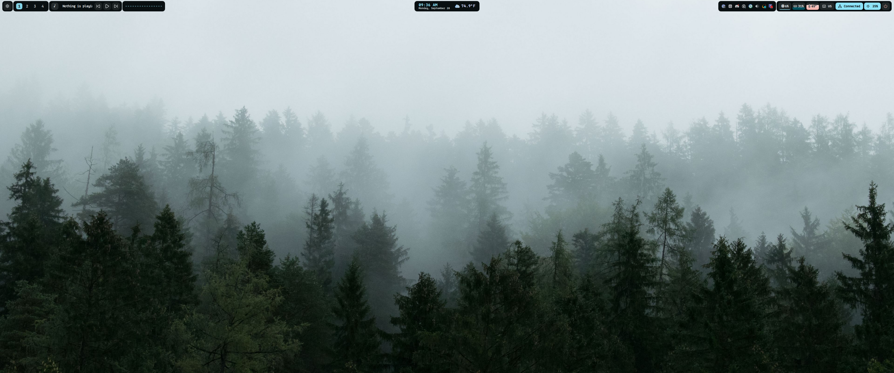

# Velum for KDE

An experimental KDE/KWin port of [Serpantinum](https://github.com/ilyamiro/serpantinum), based on `fc327946b5ee8697bddaae1021fe3db5e378deb0` (2.1.10). It runs the original Quickshell interface and assets with KDE backends. This is an independent fork, not an official KDE edition from the upstream maintainers.



The original bar and sidebar, launcher, clipboard, dock, quick settings, notifications, calendar, weather, media controls, visualizer, wallpaper picker/search, theme presets, widget editor, wellbeing dashboard, drawing tools, timers, screenshot overlay, and animations are included. The lock screen uses Serpantinum’s visual layout inside KDE’s native secure greeter.

**Development snapshot:** the KDE shell is working on the development machine, but fresh installation, reboot persistence, and multi-monitor behavior need wider testing. HyprKwin 0.12.2 and its companion animation effect are bundled and are the only tiler installed by Velum. See the [tiling notes](shell/kde/tiling/README.md) before installing.

## Use

| Shortcut | Action |
| --- | --- |
| Meta+D / Meta+Space | Launcher |
| Meta+A | Quick settings |
| Meta+I | Settings |
| Meta+V | Clipboard |
| Print | Screenshot and recording controls |
| Meta+L | KDE lock screen |
| Meta+1–9 / 0 | Switch to desktop 1–10, creating it if needed |
| Meta+Shift+1–9 / 0 | Move the window to desktop 1–10 and follow it |
| Meta+Shift+F | Float / tile the focused window |
| Meta+Shift+E | Cycle tiling layouts |
| Meta+arrows | Focus a neighboring window |
| Meta+Ctrl+arrows | Swap with a neighboring tile |
| Meta+Shift+arrows | Resize a tiled or floating window in 50-pixel steps |
| Meta+left/right mouse drag | Move / resize a window |
| Meta+Q | Close the focused window |
| Meta+Ctrl+Space | Rotate the focused split |

The settings icon at the left of the bar also opens settings. The screen edges reveal drawing, system information, and timer tools. Bar position, modules, widgets, dock, colors, typography, sounds, and animations use the original settings pages.

Automatic dwindle tiling uses bundled [HyprKwin](https://github.com/DGBooth/HyprKwin) 0.12.2 with animated tile transitions. New windows split from the focused window; dialogs and common game wrappers float. Dragging rearranges tiles on mouse release; resizing a shared edge updates neighboring tiles while dragging. This does not exactly reproduce Hyprland's drag behavior. Conflicting shortcuts are backed up and reassigned; unused HyprKwin defaults stay unbound. Existing competing tilers must be disabled first. Source revision, license and validation details are in [shell/kde/tiling/README.md](shell/kde/tiling/README.md).

KDE manages monitor modes, HDR, VRR, and scaling. This port preserves those settings. Night Light uses KDE’s global schedule, so changing it affects all displays. Workspaces are shared across displays, as they are in KWin. Each connected screen gets the original per-screen shell surfaces and widget layout.

## Local installation

Validated on Arch Linux, Plasma 6.7.5, Qt 6.11.2, Quickshell 0.3.1, Wayland. The native greeter and recorder depend on the installed KDE/Qt version and must be rebuilt after incompatible upgrades.

Required: kpackagetool6, Quickshell, Qt 6 development tools and Qt Multimedia, KDE Plasma/Screen Locker, KPipeWire recording, Python/PySide6, CMake, Ninja, qdbus6, gdbus, KScreen, Spectacle, Satty, FFmpeg, wl-clipboard, cliphist, Matugen, CAVA, jq, curl, ImageMagick, zbar, PipeWire/Pulse tools, NetworkManager, power-profiles-daemon, lm_sensors, inotify-tools, libnotify, and fontconfig. Bluetooth uses Quickshell’s BlueZ integration. The bundled fonts and sounds are retained from upstream. Install the optional `papirus-icon-theme` package for matching application and folder icons; the installer selects Papirus-Dark when available. Lucide control icons are bundled.

```sh
git clone https://github.com/danrtz/velum-plasma.git
cd velum-plasma
python3 install.py --start
```

The installer builds the native helpers, installs to `~/.local/share/velum-shell`, saves a timestamped configuration backup, registers shortcuts, and adds a KDE-only login entry. No root installation, remote push, or publishing step is performed.

While Velum runs, it replaces `plasmashell` and KDE’s polkit agent with the original Quickshell surfaces and authentication prompt. KWin, PowerDevil, KScreenLocker, KDE apps, and the rest of the Plasma session continue running. Stopping Velum restores the native desktop and polkit agent automatically. Settings, history, clipboard data, and runtime state are separate from the original Serpantinum installation.

```sh
systemctl --user restart velum-shell.service
velum restore
```

`velum restore` stops the port, restores the original backed-up Plasma settings and shortcut assignments, removes its login entry, and starts the native desktop. Updating the port keeps the first rollback baseline; subsequent snapshots are retained separately. Backups are under `~/.local/state/velum-install/backups`.

## Validation and platform differences

See [PORTING.md](PORTING.md) for the checked feature list and test limits. Automatic release updates are unavailable; this repository currently contains a development snapshot. The original updater must not overwrite the KDE adaptations.

The lock theme was checked in KDE’s greeter test mode and with populated notifications. Actual password unlock, logout/reboot/suspend, microphone capture, and physical multi-monitor hotplug require a user session/hardware check. Authentication remains entirely in KDE; the port never stores passwords or substitutes an authentication result.

## Source and attribution

`shell/src` contains Serpantinum’s UI and assets, with compositor-specific calls adapted for KDE. `shell/kde` contains the event bridge, capture/recording helpers, session integration, and installer. `shell/lockscreen` contains the native greeter adaptation. Personal settings, history, and runtime data are not included.

Serpantinum is by ilyamiro and contributors, licensed under AGPL-3.0-or-later. The combined port uses the same license; see [LICENSE](LICENSE) and [shell/LICENSE.md](shell/LICENSE.md). The KDE screencast protocol retains its license notice. Bundled third-party assets retain their upstream terms. The superseded independent native-applet prototype has been archived outside this repository; its original MIT notice is preserved under `LICENSES`.

The icon refresh uses [Papirus-Dark](https://github.com/PapirusDevelopmentTeam/papirus-icon-theme) for KDE apps and folders, and [Lucide](https://lucide.dev) for shared controls. Lucide is pinned to `66d8f9fc394b8530377e5f6112f0b8908ba01280`; its ISC/MIT notices are in [LICENSES/Lucide](LICENSES/Lucide) and beside the installed icons. The local Papirus installation uses `bf539287ef5dc18529424a02cccee76175920a6f` with its GPL-3.0 license preserved. Special glyphs and animated canvas icons retain the original design.

HyprKwin is by DGBooth and contributors, pinned to `89c3dd14d7389a38f63e750a2bf6609379efe60d`. Its GPL-3.0 license is retained in [LICENSES/HyprKwin](LICENSES/HyprKwin). Velum supplies the configuration and shortcut preset; the tiling engine and animation code are unchanged upstream source.
